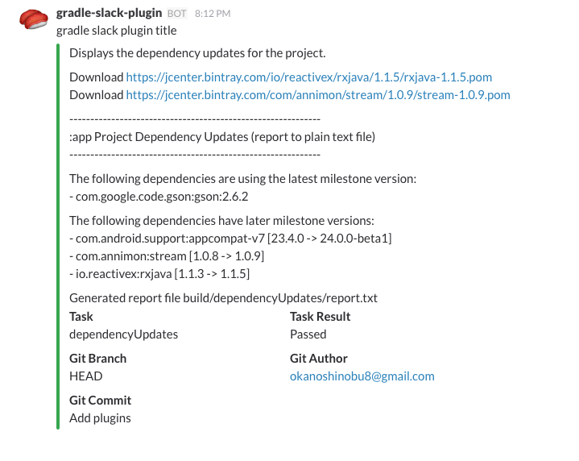

# AndroidGradleCiSample [](https://travis-ci.org/operando/AndroidGradleCiSample)

# Setup

## 1. Setting gradle-versions-plugin

Please refer to the following.

[gradle-versions-plugin Usage](https://github.com/ben-manes/gradle-versions-plugin#usage)


## 2. Setting gradle-slack-plugin

### 2.1 Build Script dependencies

Please refer to the following.

[gradle-slack-plugin Usage](https://github.com/operando/gradle-slack-plugin#usage)

### 2.2 Configuration

Then in your build.gradle file.

```gradle

// Optional
def isCi = "true".equals(System.getenv("CI"))

slack {
    url "$System.env.GRADLE_SLACK_WEBHOOK_URL"
    dependsOnTasks 'dependencyUpdates'
    title 'gradle slack plugin title'
    enabled isCi
}
```


## 3. Setting Travis CI

Please refer to the following.

[.travis.yml](https://github.com/operando/AndroidGradleCiSample/blob/master/.travis.yml)

Slack WebHook URL Secret, please rewrite to yours.

https://github.com/operando/AndroidGradleCiSample/blob/master/.travis.yml#L8
https://github.com/operando/AndroidGradleCiSample/blob/master/.travis.yml#L12

## 4. Push！Push！Push！

You will be notified as follows.



# Library and Services

## [gradle-slack-plugin](https://github.com/operando/gradle-slack-plugin)

https://github.com/operando/gradle-slack-plugin


## [gradle-versions-plugin](https://github.com/ben-manes/gradle-versions-plugin)

https://github.com/ben-manes/gradle-versions-plugin


## [Travis CI](https://travis-ci.org/)

https://travis-ci.org/

